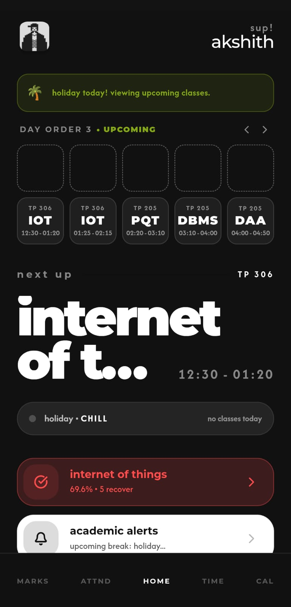
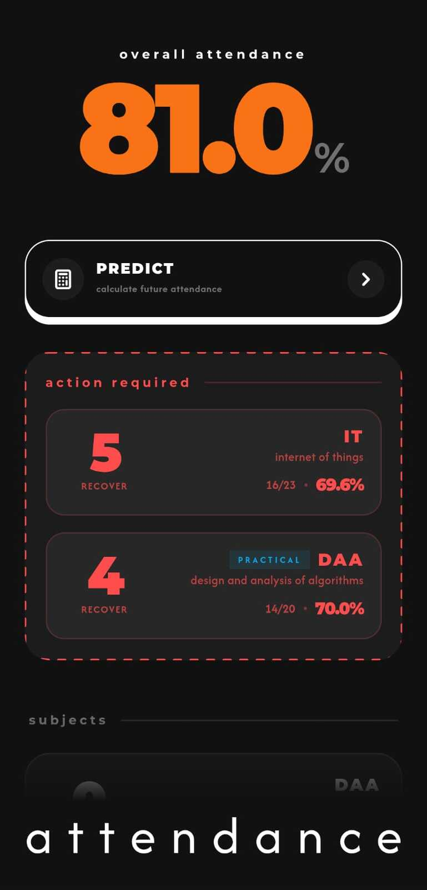

<div align="center">

### ratio'd for android

> standalone android app for ratio'd. zero cloud servers, runs directly on your phone.

[](https://nextjs.org)
[](https://developer.android.com)
[](https://capacitorjs.com)
[](https://typescriptlang.org)


&nbsp;&nbsp;


</div>

---

## what's this

standalone native android app for ratio'd. unlike the web version which routed through cloudflare and backend proxies, this app talks directly to srm student portal and academia straight from your device using native okhttp clients.

no middleman servers. no credentials stored on our end. fully offline-first.

---

## features

| feature | what it does |
|---|---|
| **zero backend** | connects straight from your device to srm portals with native okhttp |
| **dual portal support** | works with both srm student portal and academia |
| **ram-only sessions** | cookies and auth tokens stay strictly in volatile memory |
| **built-in updater** | in-app auto updates straight from github releases without play store |
| **offline first** | ui and assets bundled directly into the apk |
| **all ratio'd themes** | brutalist, minimalist, and custom palettes |

---

## architecture

```
phone
  │
  ├─▶ webview (ratio'd next.js ui)
  │      │
  │      ▼
  ├─▶ capacitor bridge (backend proxy)
  │      │
  │      ▼
  └─▶ native android plugin (okhttp)
         │
         ├──▶ sp.srmist.edu.in       (student portal)
         └──▶ academia.srmist.edu.in (zoho academia)
```

all network requests to srm are made directly from your phone's ip.

---

## stack

| layer | tech |
|---|---|
| ui | Next.js 16, React, Tailwind CSS, Framer Motion |
| native bridge | Capacitor 7 |
| networking | OkHttp 4 |
| platform | Android SDK 35 |
| updates | GitHub Releases API + Android PackageInstaller |

---

## project structure

```
ratiod-android/
├── src/                # ratio'd next.js app router & components
├── public/             # assets, fonts, icons
├── android/            # native android project
│   └── app/src/main/
│       ├── java/.../   # PortalProbePlugin, AppUpdaterPlugin, MainActivity
│       └── res/        # launcher icons, xml configs, layouts
├── capacitor.config.ts # capacitor config
└── next.config.ts      # static export config
```

---

## setup (local)

### 1. clone

```bash
git clone https://github.com/projectakshith/ratiod-android
cd ratiod-android
```

### 2. install dependencies

```bash
npm install
```

### 3. build web export

```bash
npm run build
npx cap sync android
```

### 4. build apk

```bash
cd android
./gradlew assembleDebug
```

the debug apk will be at `android/app/build/outputs/apk/debug/app-debug.apk`.

for release:

```bash
./gradlew assembleRelease
```

---

## updates

updates are shipped directly through github releases. pushing a git tag triggers the github action which builds and attaches the signed apk. the in-app updater detects new releases, downloads the apk, and prompts to install.

---

## disclaimer

ratio'd is not affiliated with SRM in any way. we don't own the portal, we don't store your data, we just make it less painful to look at. use it at your own risk, gng.

---

<div align="center">

star if you loved this hehe uwu

</div>
